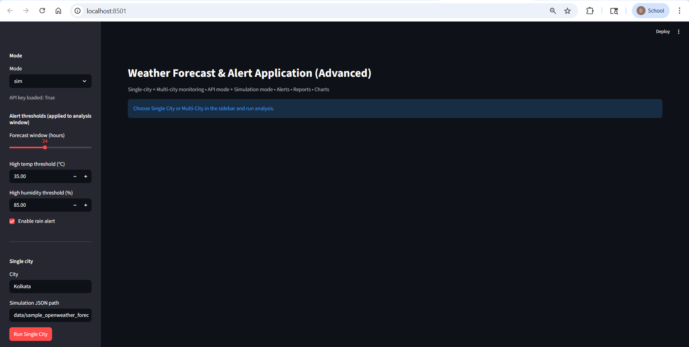
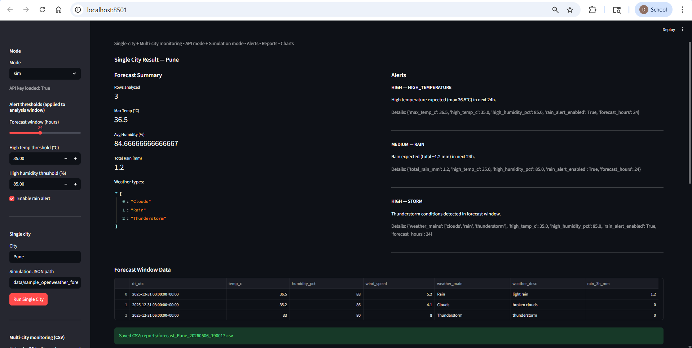
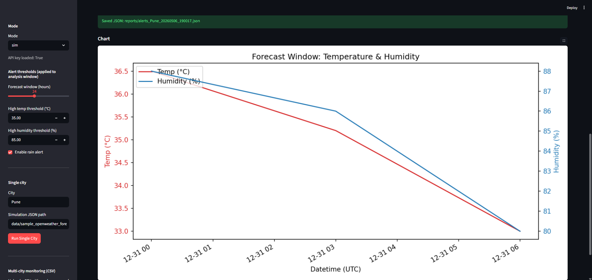
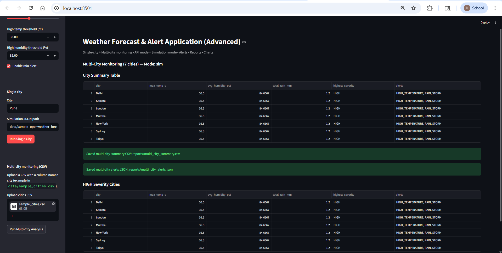
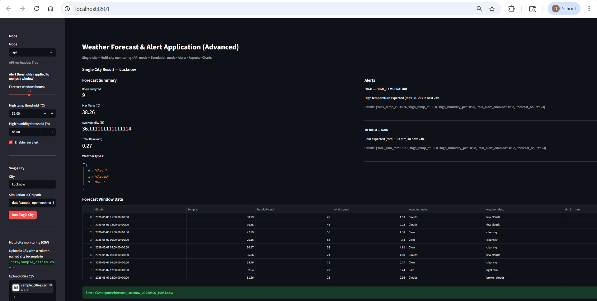
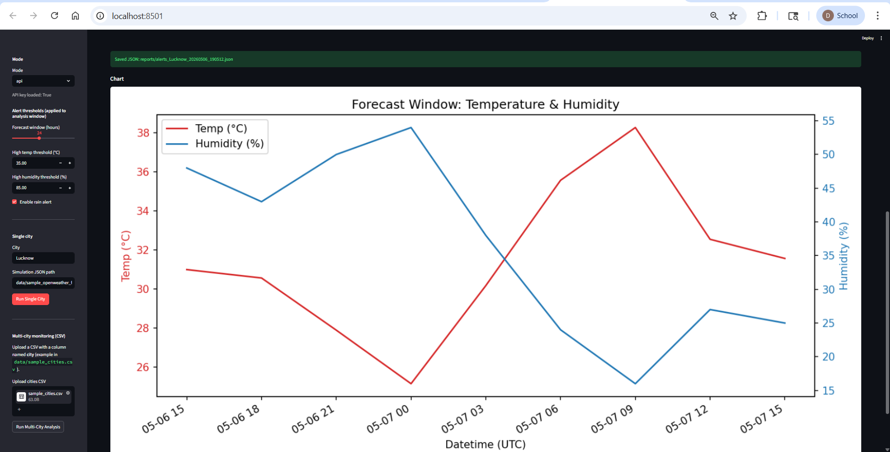
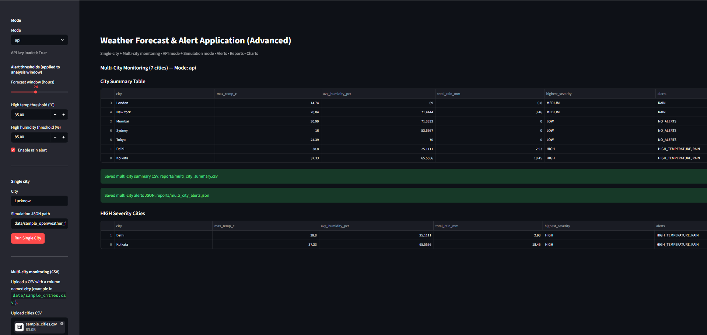
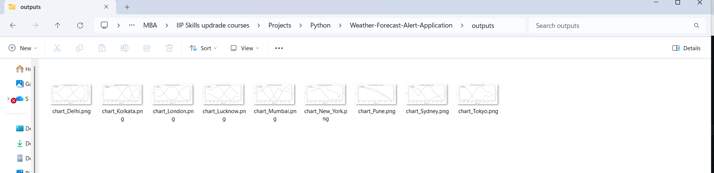
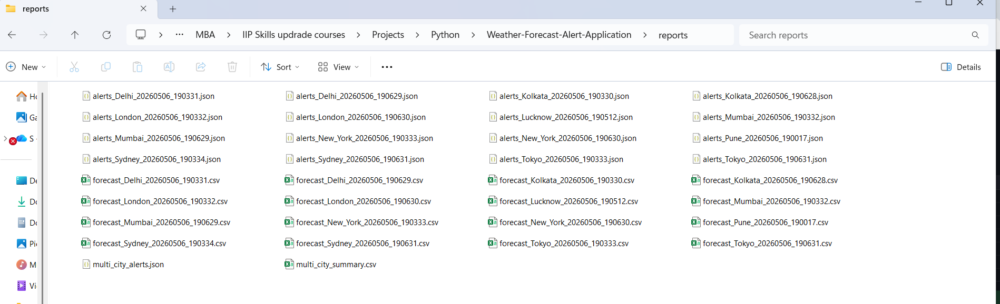

# Weather Forecast & Alert Application (Advanced)

A modular **Python + Streamlit** dashboard that fetches weather forecasts (OpenWeather API) or runs fully offline (Simulation mode), analyzes the next N hours, triggers **severity-based alerts**, and generates **CSV/JSON reports + charts** for single-city and multi-city monitoring.

---

## Live Demo / Video
- Live App: 
- Demo Video (96 sec): https://drive.google.com/file/d/1_20srfv9uFC2p3VdRkiB1EB8NLrTFO5m/view?usp=drive_link

---

## Why this project is “Advanced”
- **Dual-mode architecture**: **API mode** (real-time OpenWeather) + **Simulation mode** (offline, reproducible)
- **Multi-city monitoring** from a CSV upload (batch analysis)
- **Configurable alert thresholds** (temperature, humidity, rain) + selectable forecast window
- **Clean pipeline design**: Provider → Parser → Analyzer → Alerts → Reporting → Visualization
- **Artifacts for auditability**: per-city reports (CSV/JSON) + multi-city summary outputs
- Built with **modular code** in `src/` (easy to extend with new providers / rules)

---

## Features
### Single City
- Fetch forecast data (API) or load sample forecast (Simulation)
- Analyze next N hours (default 24)
- Generate alerts with severities (LOW / MEDIUM / HIGH)
- Save outputs:
  - `reports/forecast_<city>_<timestamp>.csv`
  - `reports/alerts_<city>_<timestamp>.json`
  - `outputs/chart_<city>.png`

### Multi City (CSV Upload)
- Upload a CSV containing a `city` column
- Runs analysis for each city
- Generates:
  - `reports/multi_city_summary.csv`
  - `reports/multi_city_alerts.json`
  - Per-city reports + charts for **each city** (same as Single City)

---

## Modes: API vs Simulation
### API Mode (OpenWeather)
- Uses OpenWeather API for real-time forecast data
- Requires `OPENWEATHER_API_KEY`

### Simulation Mode (Offline)
- Uses `data/sample_openweather_forecast.json`
- Runs the full pipeline without an API key (great for reproducible demos/testing)
- The city name is overridden to match the selected/CSV city so outputs are created per city

---

## Screenshots

Suggested set:
- 
- 
- 
- 
- 
- 
- 
- 
- 

